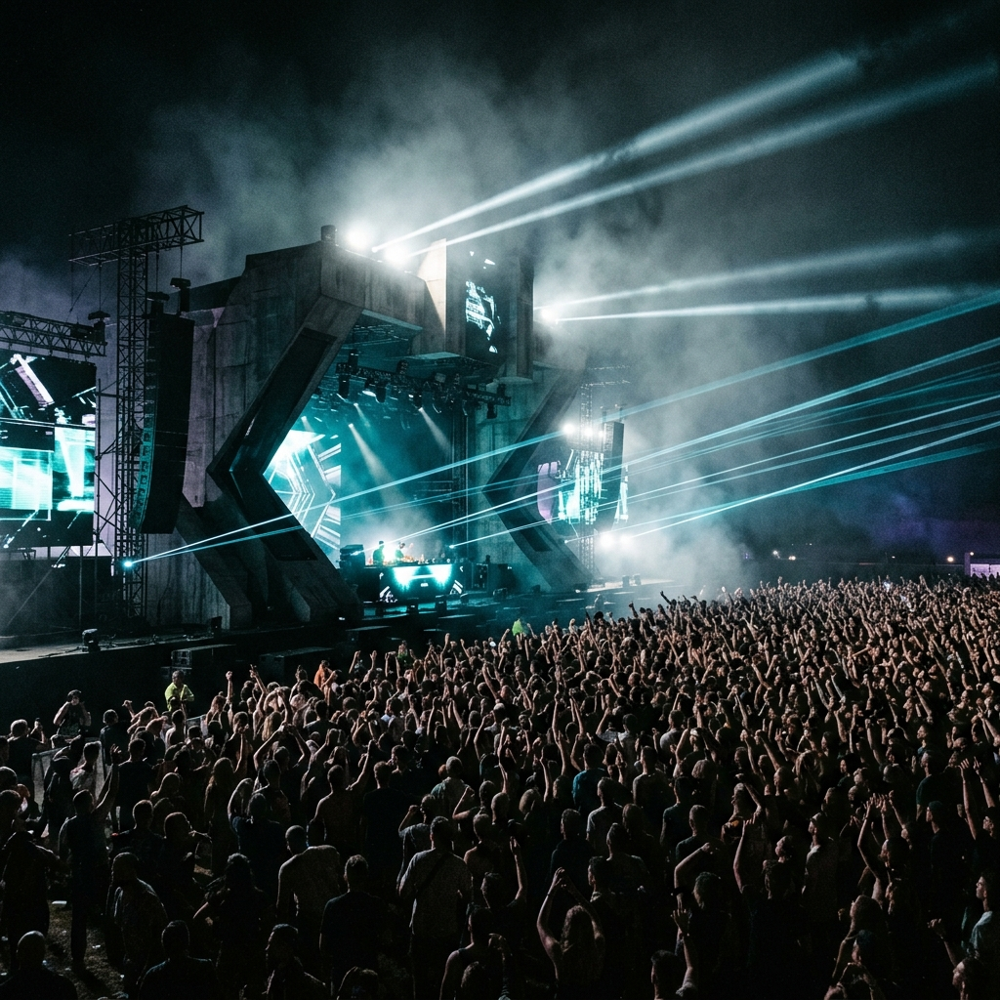

# VORTEX

> Immersive sonic experiences. Brutal architecture. Pure energy.

A production-ready website for **Vortex** — Bangalore's underground electronic music events platform. Built with a Modern Brutalist design system featuring glassmorphism, cinematic imagery, and smooth micro-animations.



---

## Tech Stack

- **Framework:** React 19 + Vite 8
- **Routing:** React Router v7
- **Styling:** Vanilla CSS (no Tailwind) — custom design system
- **Typography:** Space Grotesk · Be Vietnam Pro (Google Fonts)
- **Icons:** Material Symbols

## Design System

- Monochromatic dark palette — `#131314` background, `#7df4ff` Electric Cyan accent
- 8px spacing grid
- Glassmorphism panels (`backdrop-filter: blur`)
- Scroll-triggered `IntersectionObserver` fade-up animations
- Hero parallax effect

## Pages

| Route | Page |
|-------|------|
| `/` | Homepage — hero, upcoming events grid |
| `/event` | Event detail — Cybernetic Awakening @ Boche, Bangalore |
| `/artist` | Artist profile — Gatix |

## Getting Started

```bash
npm install
npm run dev
```

Runs at `http://localhost:5173`

## Project Structure

```
src/
├── components/
│   ├── Navbar.jsx       # Sticky nav with active route tracking
│   ├── Footer.jsx       # Footer with audio visualizer
│   ├── EventCard.jsx    # Reusable event card
│   └── FadeUp.jsx       # IntersectionObserver scroll animation
├── pages/
│   ├── HomePage.jsx
│   ├── EventPage.jsx
│   └── ArtistPage.jsx
├── App.jsx              # Routes
├── main.jsx             # Entry point
└── index.css            # Full design system
public/
└── assets/images/       # All generated imagery + SVG logo
```

## Events — Bangalore Venues

- **Boche**, Church Street
- **Just BLR**
- **Church Street Social**
